# ResoSynapse

智汇研析（ResoSynapse）是一个面向科研人员和知识工作者的综合性资源管理平台，致力于通过智能化技术提供一站式科研资源获取与管理服务。平台支持用户认证、资源推荐、智能助手、PDF 处理、文本提取与翻译、公式识别等功能，并为管理员提供强大的后台管理系统，包括用户管理、数据分析、板块与组件管理等。通过精准推荐、资源优化和智能交互，ResoSynapse 帮助用户高效获取和管理科研资源，提升科研效率，助力创新突破。

## 项目结构

```bash
ResoSynapse/
├── frontend/
│   ├── admin/     # 管理员门户
│   ├── lead/      # 引流用户端门户
│   ├── user/      # 普通用户门户
│   └── *.bat      # 不同门户的启动脚本
└── backend/
    ├── Djangobackend/   # Django 主后端服务
    ├── AITool/          # AI 处理服务
    └── *.bat            # 后端服务启动脚本
```

## 前端部分

### 引流用户端（Lead Portal）

引流用户端是系统的对外展示窗口，主要面向潜在用户，提供以下功能：

#### 用户认证
- 用户注册：支持用户名、邮箱和密码注册  
  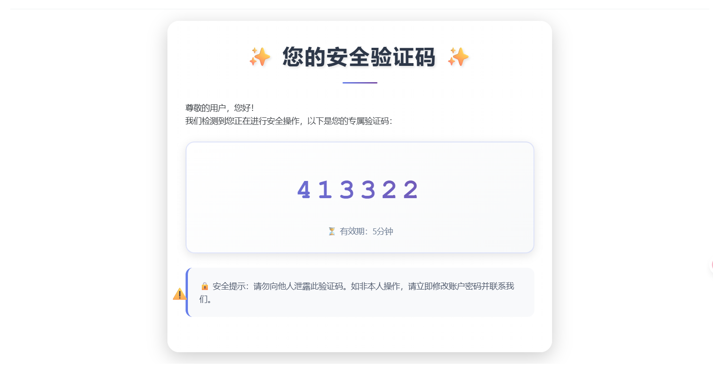
- 用户登录：支持账号密码登录
- 图片验证码：提供验证码验证功能

#### 资源展示
- 主页信息展示：包括导航文本、背景图片等

  * 可通过侧边栏快速跳转对应模块

  

- 板块展示：按设定顺序展示各类资源板块，支持响应式布局  
  - 一行 8 个  
    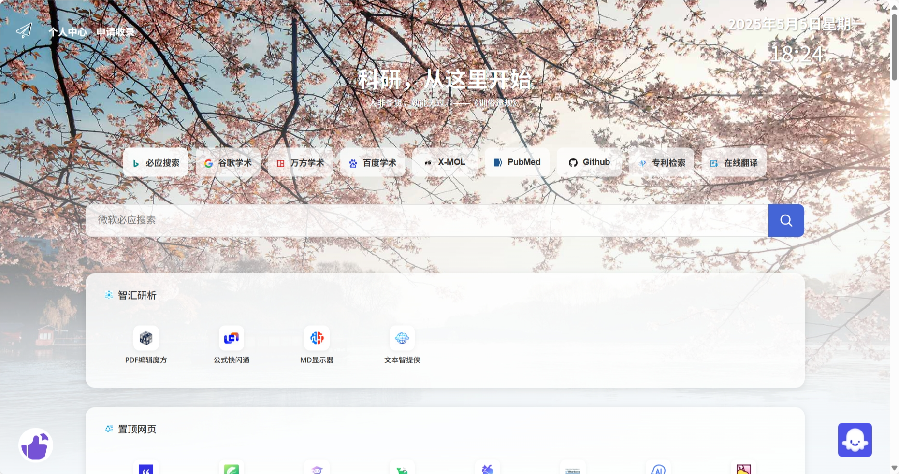  
  - 一行 6 个  
    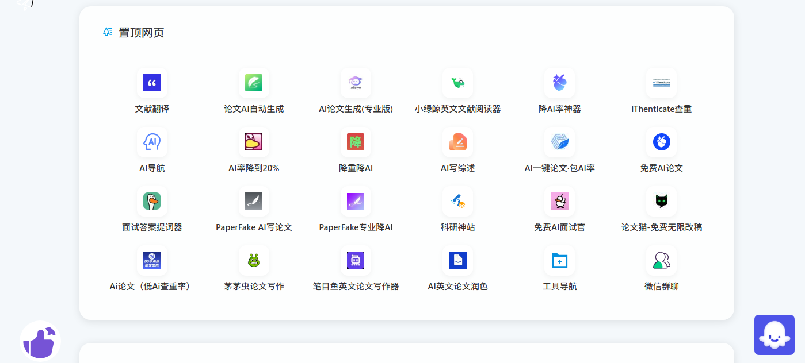  
  - 一行 4 个  
    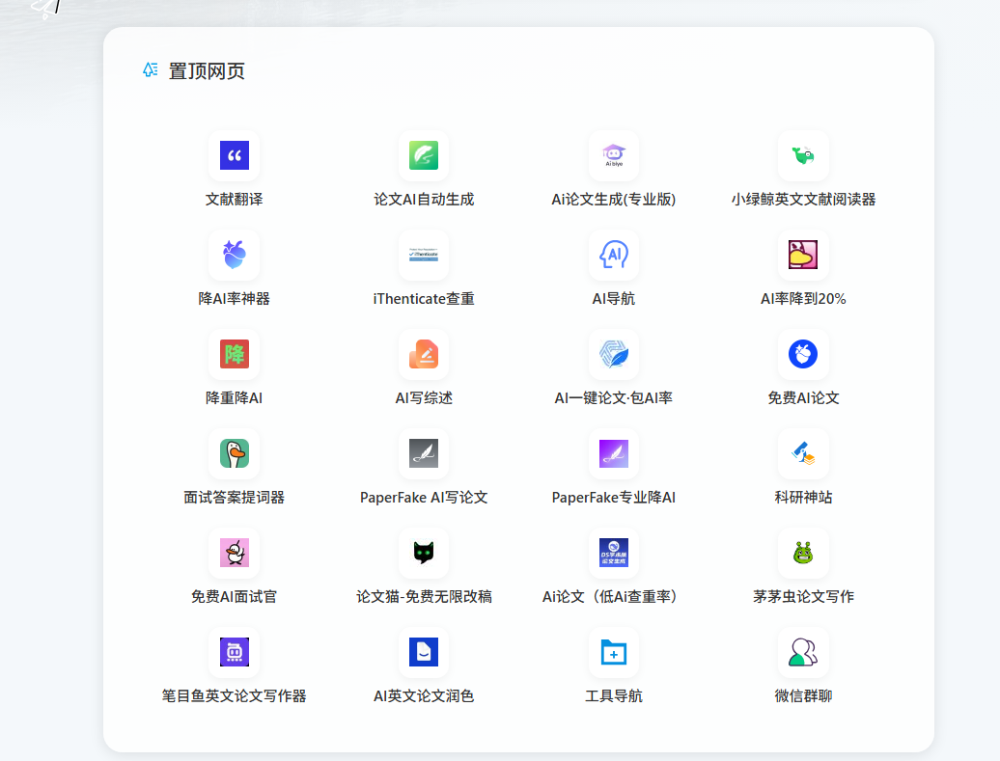
  
- 组件使用：提供各类功能组件的使用

#### 用户交互
- 评价反馈：支持多维度评分
- 资源申请：支持用户提交资源收录申请
- 智能助手：提供资源推荐和功能使用指导

### 普通用户端（User Portal）

普通用户端是系统的核心功能入口，提供以下主要功能：

#### PDF 编辑魔方
- 服务管理：创建、修改、删除 PDF 处理服务
- 文件操作：添加、排序、删除图片/PDF 文件
- 文件导出：支持 PDF 和图片包下载  
  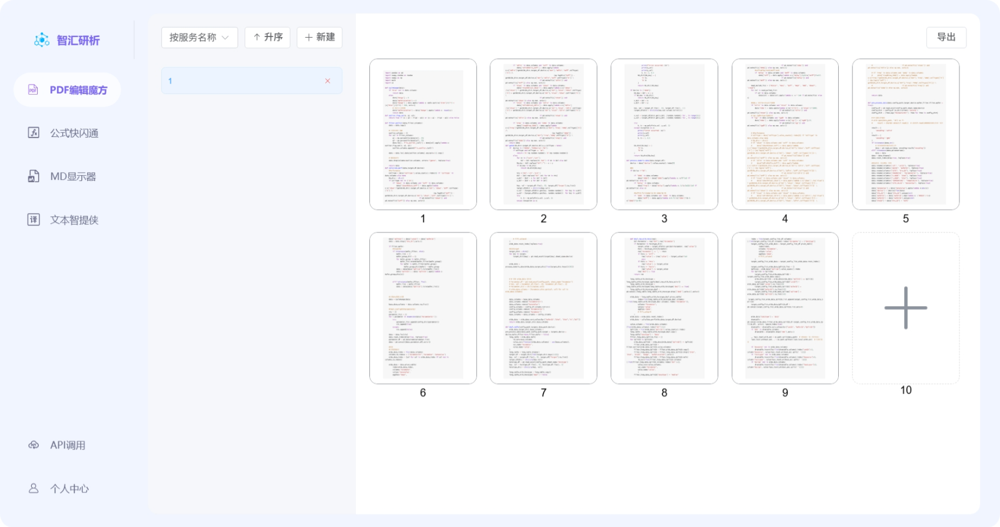

#### 智能工具
- 公式识别：支持图片公式 OCR 识别  
  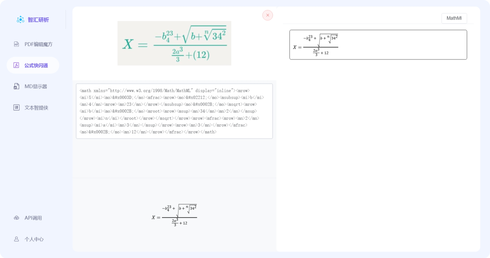
- 文本提取：支持图片、视频、音频文本提取
- 多语言翻译：支持多语言文本翻译  
  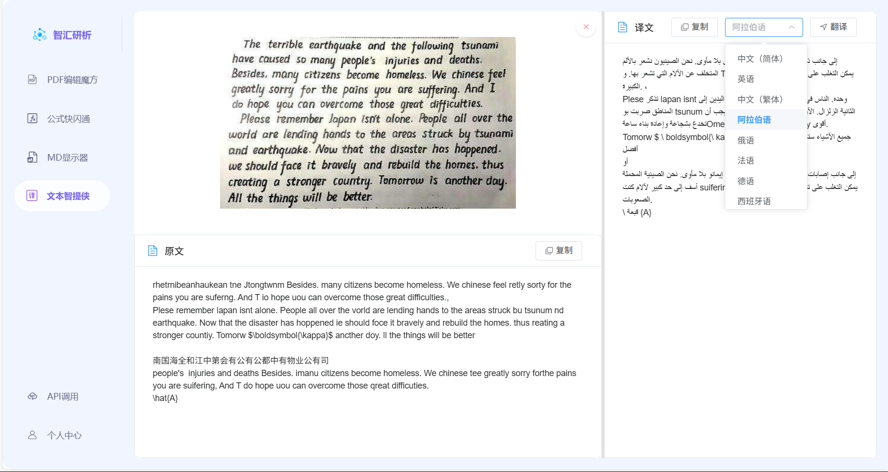  

#### 思维导图显示器
- 智能对话：支持文件上传分析
- 思维导图：自动生成对话思维导图
- 输出控制：支持流式/非流式输出切换
- 支持调整窗口大小，便于控制思维导图和对话框的占比  
  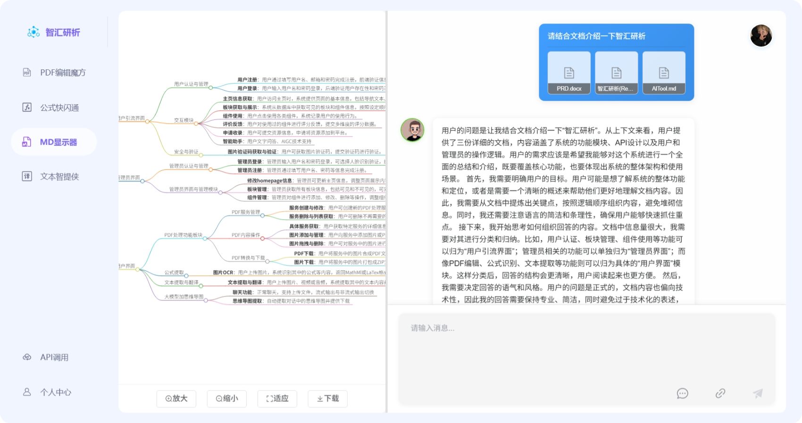  
  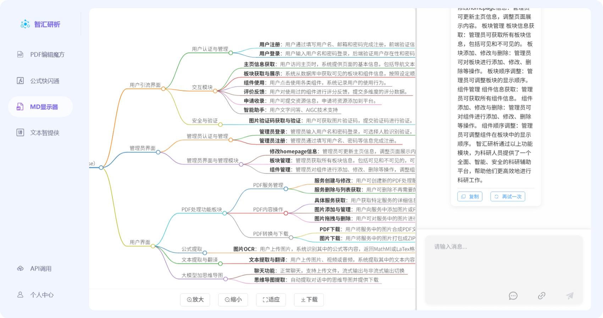

### 管理员端（Admin Portal）

管理员端是系统的管理控制中心，提供以下功能：

#### 系统管理
- 管理员认证：支持账号密码登录
- 管理员注册：支持新管理员账号创建

#### 内容管理
- 主页管理：更新主页信息和展示内容  
  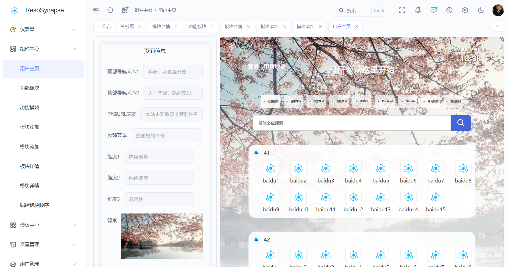
  
- 组件管理：管理各类功能组件及其显示顺序  
    
  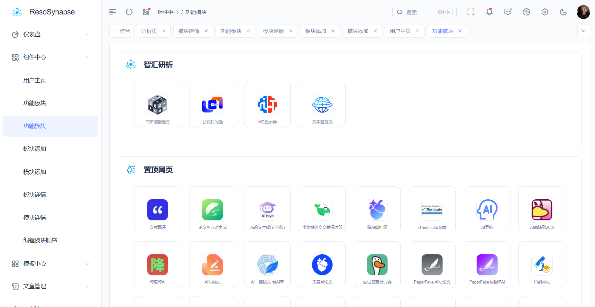
  
- 板块管理：添加、修改、删除板块，调整显示顺序  
  - 板块添加 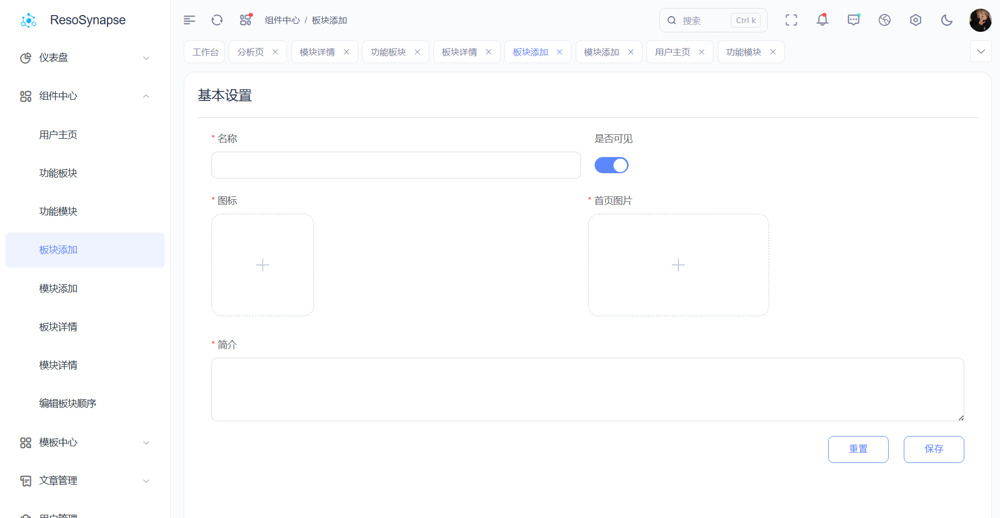
  
  - 模块添加 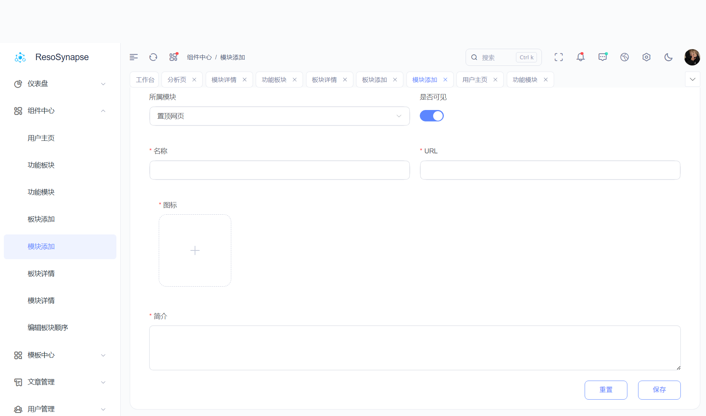
  
  - 板块详情1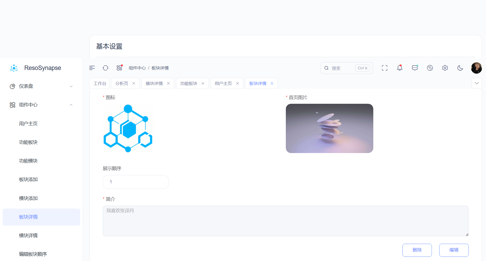
  
  - 板块详情2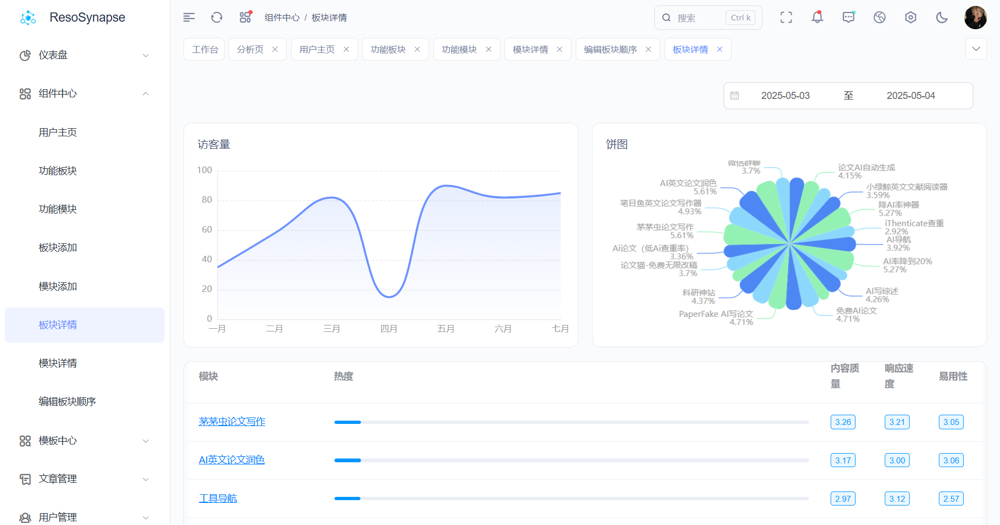
  
  - 模块详情 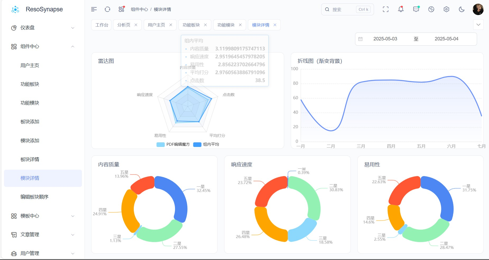

#### 用户管理
- 用户信息管理
- 权限控制
- 使用统计

## 前端介绍

### 技术栈
- 框架：Vue + TypeScript
- 构建工具：Vite
- 运行环境：Node.js

### 环境要求
- Node.js (v16+)
- pnpm（推荐）或 npm

### 安装与启动

```bash
# 安装依赖
npm install

# 选择门户启动
# 管理员门户
frontend/admin.bat

# 引流用户端门户
frontend/lead.bat

# 普通用户门户
frontend/user.bat
```

## 后端介绍

### 项目结构
ResoSynapse 的后端部分包含两个主要服务：
- **Django 后端**：基于 Django REST Framework 的主后端服务
- **SpringBoot 服务**：用于特定功能的后端服务

### 技术栈
- Django 后端：Python 3.8+
- SpringBoot 服务：Maven 3.6+

### 环境要求
- Python 3.8+
- Maven 3.6+
- MySQL 5.0+

### 安装与启动

```bash
# 安装依赖
pip install -r documents/requirements.txt

# 启动Django后端
backend/Django.bat

# 启动Spring Boot服务（需要Maven）
backend/SpringBoot.bat
```

## 集成启动

```bash
# 每个bat一个终端
ResoSynapse1.bat

# 所有bat共用一个终端
ResoSynapse2.bat
```

## 集成安装前端环境

```bash
setup.bat
```

## 注意事项

### 邮箱配置
在 `backend\Djangobackend\Djangobackend\email.py` 中补充邮箱注册功能。

### 系统配置
在 `backend\Djangobackend\utils\config.py` 中补全配置：

```python
SMTP_PORT = 0
SENDER_EMAIL = ""
SENDER_PASSWORD = ""
KIMI_API_KEY_LIST = []
FFMPEG_DIR = r""
MD_AIGC_DIR = "tempDir"
PNG_DIR = "tempPng"
VIDEO_DIR = "tempVideo"
PDF_DIR = "tempPdf"
ZIP_DIR = "tempZip"
```

### 数据库配置
在 `backend\AITool\src\main\resources\*.yml` 中修改配置：

```yaml
datasource:
    url: jdbc:mysql://localhost:3306/aitooldb?useSSL=false&characterEncoding=utf8
    username: root
    password: 123456
```

在 `backend\Djangobackend\settings.py` 中修改配置：

```python
DATABASES = {
    'default': {
        'ENGINE': 'django.db.backends.mysql',
        'NAME': 'aitooldb',
        'USER': 'root',
        'PASSWORD': '123456',
        'HOST': 'localhost',
        'PORT': '3306',
    }
}
```

## 数据库

系统使用 MySQL 数据库存储数据，主要包含以下数据表：
- 用户信息表
- 服务信息表
- 文件信息表
- 组件信息表
- 板块信息表

数据库初始化脚本位于 `documents/aitooldb.sql`。

## 接口文档

系统提供完整的 API 接口，支持：
- 用户认证与管理
- 服务创建与修改
- 文件上传与处理
- 智能分析服务
- 数据导出功能

详细的接口文档请参考 `documents/2.5interface.md`。
